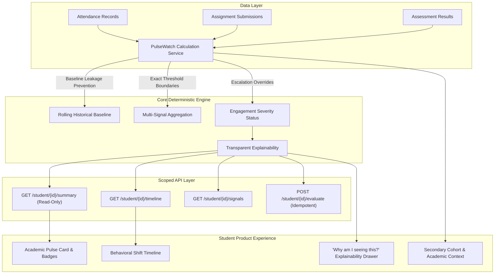

# Phase 3 Walkthrough: PulseWatch Deterministic Behavioral Monitoring Foundation

## Overview

CampusPulse **Phase 3: PulseWatch** establishes a production-grade, deterministic behavioral monitoring foundation. PulseWatch tracks shifts in student academic engagement relative to their own personal baseline and available cohort context, with zero black-box scoring, zero dropout probability estimation, zero mental-health inference, and zero LLM decision-making.

---

## Architecture & Subsystems Delivered

---

## Key Technical Achievements

### 1. Database Schema & Migration 0005
- `StudentBehaviorBaseline`: Rolling historical baselines for attendance, submission rate, and assessment average.
  - Unique Constraint: `(student_id, metric_type, window_days, algorithm_version)` (`uq_student_baselines_metric_window_algo`).
  - Performance Index: `ix_student_baselines_student_metric`.
- `BehaviorEvent`: Persisted academic engagement shift events with full status tracking.
  - Unique Constraint for Idempotency: `(student_id, observation_window_days, window_start_date, window_end_date, algorithm_version)` (`uq_behavior_events_student_window_algo`).
  - Time-Series Index: `ix_behavior_events_student_detected`.
- `BehaviorSignalEvidence`: Granular quantitative metrics with FK cascade deletion and index `ix_signal_evidence_event_signal`.
- `alembic check`: Confirmed **0 schema drift** ("No new upgrade operations detected").

### 2. Pure Deterministic Calculation Engine
- **Baseline Leakage Prevention**: Personal baseline window $[T-M-N, T-N)$ strictly ends before the observation window $[T-N, T]$ ($T_{\text{baseline\_end}} < T_{\text{observation\_start}}$).
- **Exact Mathematical Thresholds**:
  - $\Delta \ge -5.0\% \rightarrow \text{NORMAL}$
  - $-15.0\% \le \Delta < -5.0\% \rightarrow \text{MILD\_CHANGE}$
  - $-25.0\% \le \Delta < -15.0\% \rightarrow \text{MODERATE\_CHANGE}$
  - $\Delta < -25.0\% \rightarrow \text{SIGNIFICANT\_CHANGE}$
- **Earliest Valid Submission Attempt Rule**: Assignment lateness is evaluated strictly on the earliest valid attempt ($\min(\text{submitted\_at}) \le \text{due\_date}$) across eligible statuses (`SUBMITTED`, `LATE`, `EVALUATED`, `RESUBMITTED`).
- **Zero Denominator Guard**: If eligible assignments count is 0, returns `NO_DATA` / `null`, never `0.0%`.
- **Deterministic Escalation Overrides**:
  - Consecutive absences ($\ge 3$) escalate attendance to `SIGNIFICANT_CHANGE` (regardless of percentage delta).
  - Formal assessment absence (`is_absent == True`) escalates assessment performance to `SIGNIFICANT_CHANGE`.
  - Multi-Signal Combination: 1 significant or $\ge 2$ moderate signals combine into `SIGNIFICANT_CHANGE`; 1 moderate signal results in `MODERATE_CHANGE`; $\ge 1$ mild signal results in `MILD_CHANGE`.

### 3. Read-Only Summary & Idempotent Persistence
- `GET /api/v1/pulsewatch/student/{id}/summary` executes with **zero database writes**.
- `POST /api/v1/pulsewatch/student/{id}/evaluate` updates existing records upon re-evaluation without creating duplicate events or duplicate baselines.

### 4. Security & Scoping Controls
- Enforced via `verify_student_record_access`:
  - Students strictly restricted to their own behavioral records. Cross-student inspection returns **HTTP 403 Forbidden**.
  - Faculty restricted to students enrolled in their assigned courses.
  - Institutional oversight for Administrators.

### 5. Frontend Academic Pulse Experience
- **Student Dashboard (`/student`)**:
  - `AcademicPulseCard`: Displays status badge, summary text, and 3 metric pills (Attendance Stability, Coursework Pacing, Evaluation Marks).
  - `PulseExplainModal`: Interactive **"Why am I seeing this?"** drawer detailing what changed, baseline comparison, observation window, data sufficiency, and non-punitive institutional disclaimer.
- **Student Academics (`/student/academics?tab=pulse`)**:
  - Dedicated **Academic Pulse** tab.
  - Secondary Cohort Context Card (cohort attendance rate, submission rate, marks average, and non-overriding note).
  - Academic Environmental Context Card (upcoming assessments, deadline clustering, untracked contexts).
  - Historical Behavior Events Timeline with evidence pills.

---

## Verification Evidence

| Verification Suite | Result | Details |
|---|---|---|
| **Backend Pytest (`pytest backend/tests -v`)** | **65 passed, 0 failed** | 17 PulseWatch tests, 15 Academic tests, 15 Auth/RBAC tests, 18 Smoke tests (0 skipped, 0 failed) |
| **Alembic Drift Check (`alembic check`)** | **0 drift** | "No new upgrade operations detected" |
| **Frontend Typecheck (`tsc --noEmit`)** | **0 errors** | Clean compilation across all types and components |
| **Frontend Lint (`next lint`)** | **0 warnings, 0 errors** | Strict Next.js and ESLint validation |
| **Frontend Production Build (`next build`)** | **18/18 routes passed** | All static and dynamic pages compiled successfully |
| **Playwright E2E Suite (`npx playwright test`)** | **26 passed, 0 failed** | 100% pass rate across academic, auth, product experience, pulsewatch, and smoke suites |

---

## Strict Scope Boundaries Preserved

The following were strictly excluded in accordance with the Phase 3 specification:
- No PulseRisk scoring models
- No dropout predictions or probability models
- No mental-health inference or diagnostics
- No LLM / AI decision-making
- No LMS ingestion (deferred to subsequent phase)
- No complaints, leave, or case management
- No counselor intervention workflows
